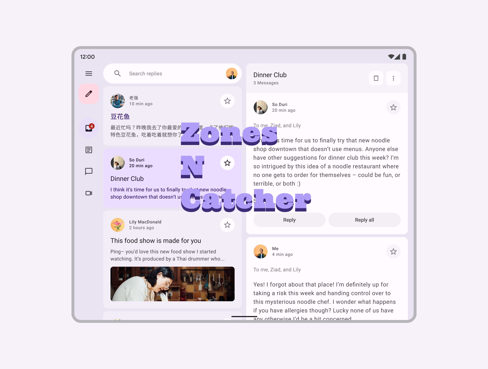

# zones_n_catcher

Zones N Catcher shows how to use the Catcher package to super power using Dart Zones in Flutter Apps to catch app exceptions:

[Catcher](https://pub.dev/packages/catcher)

My bias is that I contribute to this Flutter Community package.

## The Medium Article

This is the friends free link to the article:

[Master Zones For Super App Exception Powers](https://fredgrott.medium.com/master-zones-for-super-app-exception-powers-2a4f24ae39a?sk=4d1f7aa2f25190d956b871e31acd828d)

And you should sign up for my Email newsletter at my medium blog:

[Fred Grott's Medium Blog](https://fredgrott.medium.com)

## References

[Catcher Docs](https://pub.dev/packages/catcher)

[Sentry Docs](https://docs.sentry.io/platforms/flutter/)

## About Fred Grott

Hi there, this is Fred Grott. I recently re-booted my life by getting control of my ADHD through such things as creating a note taking system using VSCode and ZettleKatsen note taking systems. 

My goal here is to bootstrap myself into mastering Flutter app development while at the same time teach you the expert fltter best practices that are not in the flutter docs.

Lets make Flutter Apps Awesome!

You can follow me on:

[Fred Grott at keyBase](https://keybase.io/fredgrott)

[Fred Grott at Twitter](https://twitter.com/fredgrott)

[Fred Grott at GitHub](https://github.com/fredgrott)

## Getting Started

This project is a starting point for a Flutter application that follows the
[simple app state management
tutorial](https://flutter.dev/docs/development/data-and-backend/state-mgmt/simple).

For help getting started with Flutter, view our
[online documentation](https://flutter.dev/docs), which offers tutorials,
samples, guidance on mobile development, and a full API reference.

## Assets

The `assets` directory houses images, fonts, and any other files you want to
include with your application.

The `assets/images` directory contains [resolution-aware
images](https://flutter.dev/docs/development/ui/assets-and-images#resolution-aware).

## Localization

This project generates localized messages based on arb files found in
the `lib/src/localization` directory.

To support additional languages, please visit the tutorial on
[Internationalizing Flutter
apps](https://flutter.dev/docs/development/accessibility-and-localization/internationalization)
